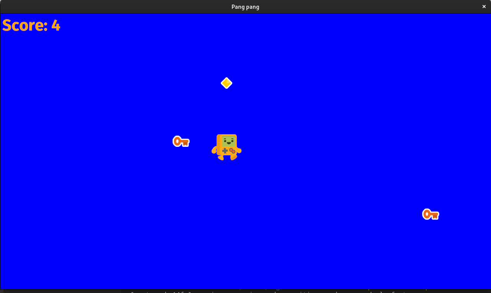

# Pang Pang

This is a simple 2D game made in Rust using Bevy. 

You control the player using the arrow keys. Press space to shoot in the direction you were last facing. 

Enemy keys appear and you lose score if they touch you. Shoot them to gain score. 

